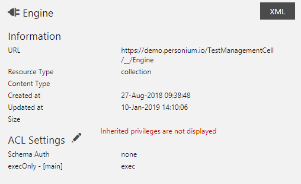
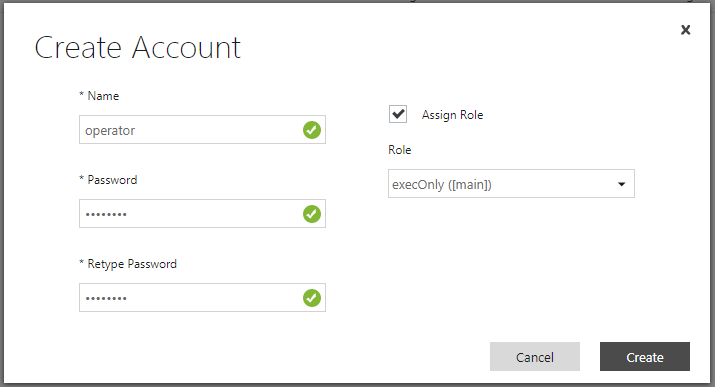

# Description  
Personium Engine Scripts that manage an organization of Cells within a Unit.  
> This tool is for Personium Unit owner or administrator.  

This repository contains the necessary files (JavaScript) needed to construct a very simple Personium App Cell. It provides the following functions (REST API endpoints).  

1. create User Cell  
1. delete User Cell  
1. reset User Cell password  

# Files to be modified and upload to your app Cell    

    │      
    └─src
      └─engine
            acc_info.js (must specify Unit Admin Cell and your App Cell's information)
            adapter.js (must specify general user Cell information)

# Before you start  
Make sure you have Unit Admin level permission over your app Cell.  

Due to current implemetation of Personium Core, the followings will happen and require you to re-login as Unit Admin.  

1. The app Cell's user account will be overwritten with random password when importing a Cell from another Personium Unit.  
1. Unit/Cell Manager will be logged out automatically after importing a Cell.  

# Tutorial  
Follow the steps below to create and start managing your user Cells.  

1. How to deploy  
Take a look at the guide on [How to deploy](doc/HowToDeploy.md) the minimal app.  

1. How it works  
Install Restlet Client in Chrome and import the [scenario](doc/RestletClient.json). Fill in your app Cell information in Environment variables.   
> You need basic knowledges of REST API and how Restlet Client works.  

## Role for executing the REST APIs only  
To improve security, the Engine endpoints can be executed without the admin user token.  
We configure the Engine service to permit account with "execOnly" role to execute the Engine endpoints.  
  

All you have to do is to create an account and assign the "execOnly" role to it.  
Then, you can use the created account information to get a user token.  
  
