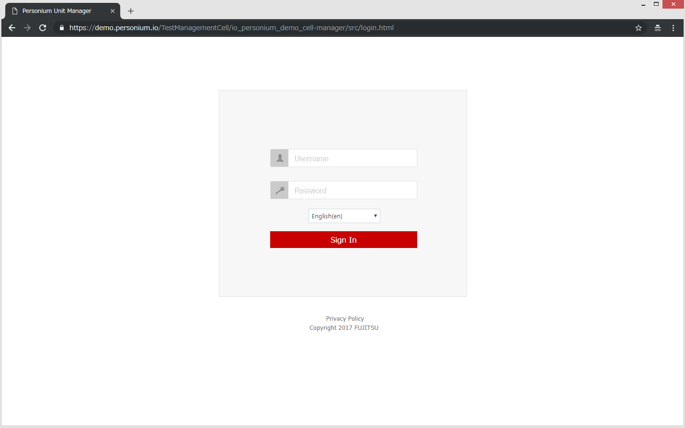
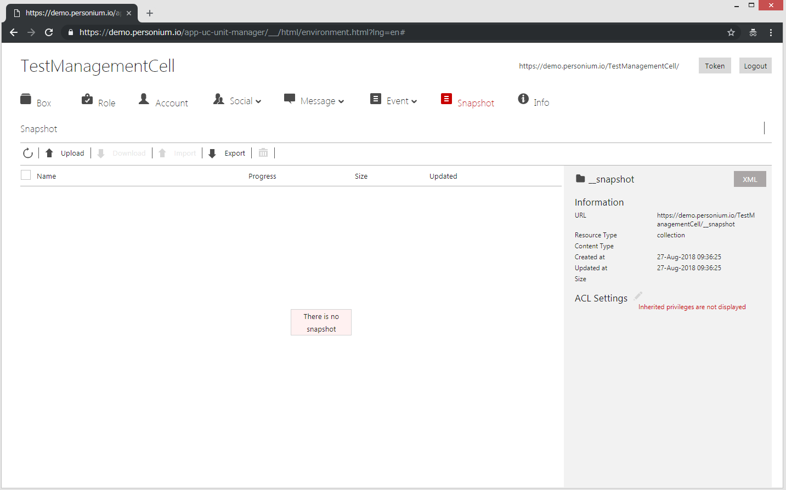
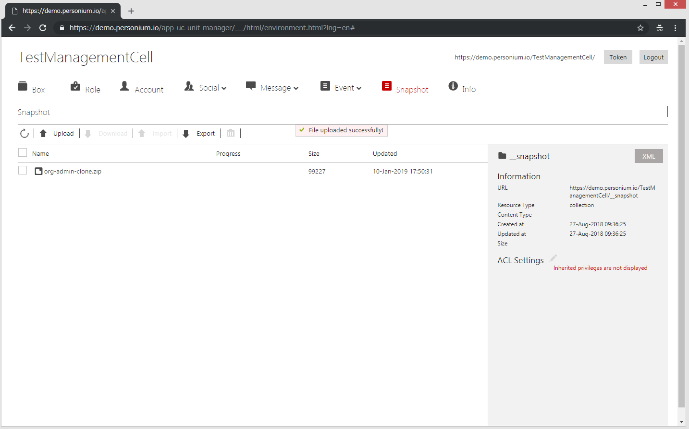
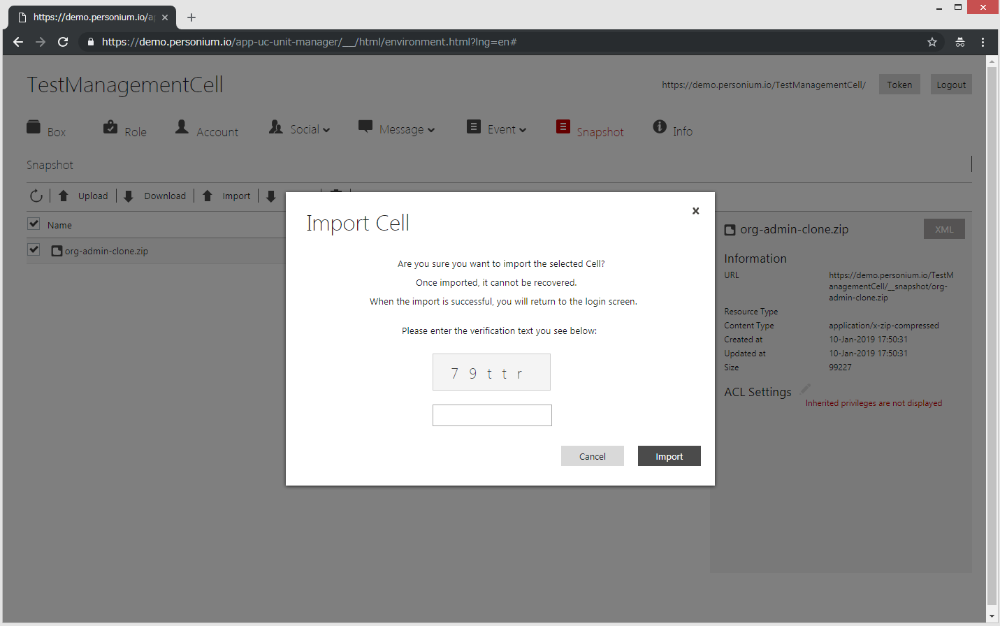
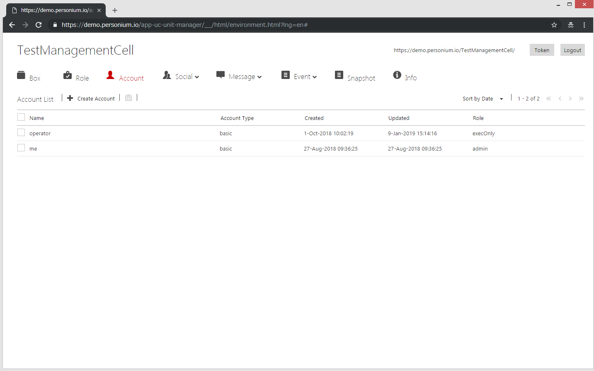
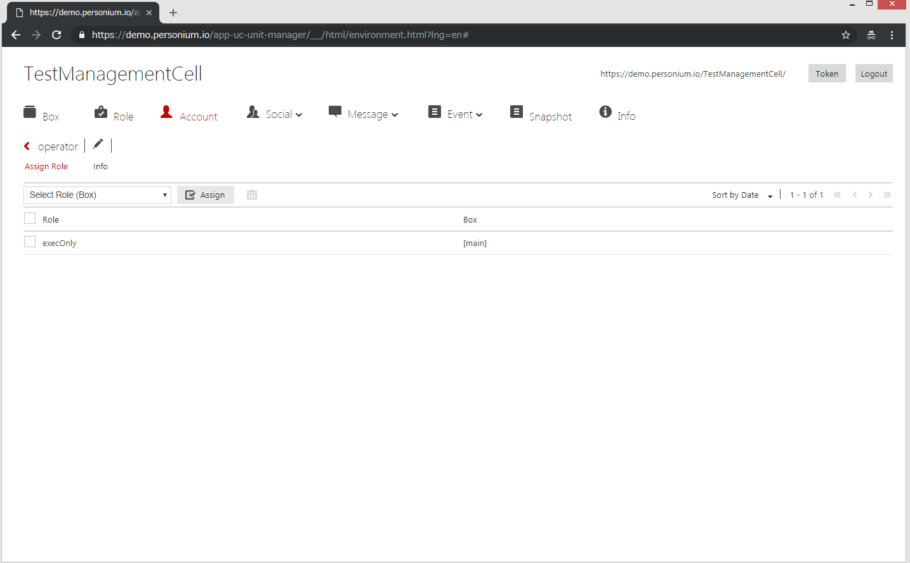
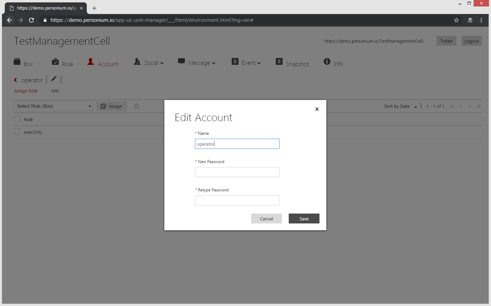

# How to deploy  
We use "https://demo.personium.io/TestManagementCell/" in this example, but make sure you use your own Personium Cell URL.  
## Before deploying  
Download the [zip file](/org-admin-clone.zip).  

## Deploying the files  
1. Use Cell Manager to access your app Cell.  
  
1. From Snapshot menu, click the "Upload" button and  the [zip file](/app-minimal-clone.zip).  
    - Before  
      
    - After  
      
1. From Snapshot menu, select the file and then click the "Import" button.   
You will be logged out automatically so that you will not be able to corrupt the Cell content.  
If your browser displays error message, ignore it and reload the page.  
    - Confirmation:   
      
1. Wait for a minute and then Re-login.  
    - If you are using your Personium Unit, login as Unit Admin and set your app Cell's password again.  

1. Specify the app Cell URL in the following files:  
    1. Download, modify then upload the main/Engine/__src/acc_info.js  
    This is the file that all other Engine Script refers to when authentication is needed.  
    Double check that the Engine Service's ACL is configured to exec (not read) to avoid showing the ID/Password in this file.  
    For this tutorial, you only need to modify the following variables.  

            /*
             * Begin of your Personium app configurations
             */
            var unitUrl = '***'; // for example: https://demo.personium.io/
            var unitAdminCellUrl = '***'; // for example: https://demo.personium.io/unitAdminCellName/ or https://unitAdminCellName.demo.personium.io/
            var unitAdminID = '***';
            var unitAdminPass = '***';
            ...
            /*
             * End of your Personium app configurations
             */

    1. Download, modify then upload the main/Engine/__src/adapter.js  

            const USER_CELL_PREFIX = "***"; // for example: "-u"

            const USER_ACCOUNT_NAME = "***"; // for example: "me"

            const CREATE_BOX_NAME = "***"; // for example: "tutorial"
            const CREATE_BOX_SCHEMA_URL = "***"; // for example: https://demo.personium.io/appCellName/ or https://appCellName.demo.personium.io/

            const CREATE_ODATA_NAME1 = "***"; // for example: "T_Question"
            const CREATE_ODATA_NAME2 = "***"; // for example: "T_Answer"

            const CREATE_ODATA_ENTITY_NAME1 = "***"; // for example: "Question"
            const CREATE_ODATA_ENTITY_NAME2 = "***"; // for example: "Answer"
    

    1. Perform the following to modify the account password in your app Cell.  
    > Make sure you modify both "me" and "operator".  
        1. From Account menu, click the account name (e.g. "operator") to display details.  
            - Before  
              
            
            - After  
               

        1. Modify the password by clicking the "Pencil" icon.  
            - Enter the password (appUserPass) specified in acc_info.js.    
              
 
